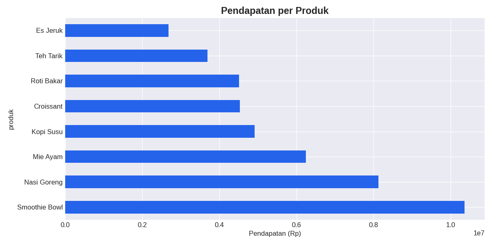
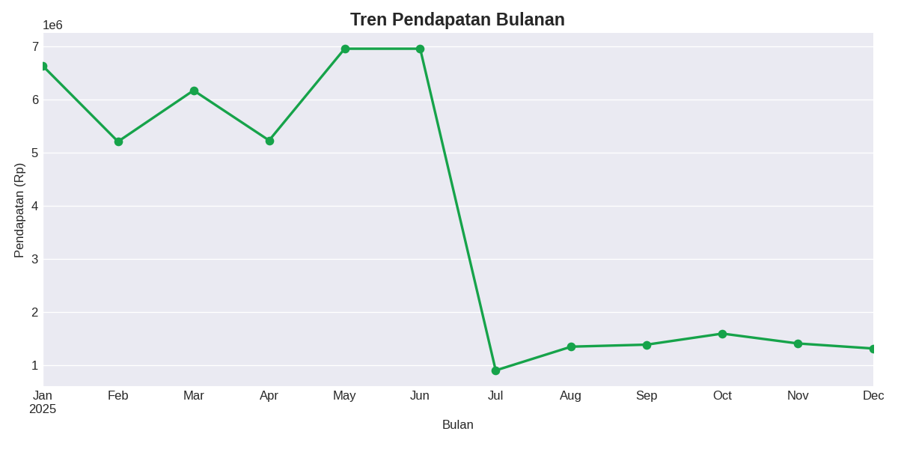

# DAY 2 — Data Science: Analisis Penjualan UMKM

**Bidang:** Data Science / Data Analytics (Fundamental → Intermediate)
**Output:** Dataset bersih + notebook analisis + visualisasi + ringkasan untuk fase AI.

---

## 🎯 Tujuan Hari Ini

Membangun **fondasi data** untuk SmartData Platform. Saya berperan sebagai *Data Analyst* yang menerima data mentah penjualan UMKM, lalu membersihkannya dan menghasilkan insight pertama.

Ini memenuhi requirement yang sudah saya rancang di DAY 1:
- **FR-01** — memuat dataset dari CSV
- **FR-02** — membersihkan & meringkas data

> 🔗 **Keterkaitan dengan DAY 1:** Charter & scope kemarin menetapkan bahwa data adalah inti produk. Hari ini saya mewujudkannya. Ringkasan yang dihasilkan (`summary.json`) akan menjadi **input langsung untuk DAY 3 (AI)**.

---

## 📊 Tentang Data

Dataset penjualan UMKM fiktif (kedai makanan & minuman) dengan 500+ transaksi. Data ini sengaja dibuat **"kotor"** agar proses pembersihannya nyata dan bisa saya tunjukkan sebagai skill:

| Masalah pada data mentah | Solusi yang diterapkan |
|--------------------------|------------------------|
| Format tanggal beragam (`2025-01-01` vs `01/01/2025`) | Disamakan dengan `pd.to_datetime` |
| Nama kota tidak konsisten (`JAKARTA`, ` Jakarta `) | Dinormalkan dengan `.strip().title()` |
| Nilai `jumlah` ada yang kosong | Diisi dengan median |
| Baris duplikat | Dihapus dengan `drop_duplicates()` |

---

## 📂 Isi Folder

```
day-02-data-science/
├── README.md
├── generate_data.py      ← membuat dataset mentah (reproducible)
├── analysis.py           ← script analisis lengkap
├── analysis.ipynb        ← versi notebook (lebih enak dibaca)
├── data/
│   ├── sales_raw.csv     ← data mentah (kotor)
│   └── sales_clean.csv   ← data bersih (hasil)
└── output/
    ├── pendapatan_per_produk.png
    ├── tren_bulanan.png
    └── summary.json      ← ringkasan → input untuk DAY 3
```

---

## ▶️ Cara Menjalankan

```bash
pip install pandas matplotlib
cd day-02-data-science
python generate_data.py    # buat dataset
python analysis.py         # jalankan analisis
```

Atau buka `analysis.ipynb` di Jupyter/VS Code untuk versi interaktif.

---

## 📈 Hasil Utama

- **Total transaksi bersih:** ~499 (dari 520 baris mentah)
- **Insight:** produk dengan pendapatan tertinggi & kota dengan penjualan terbaik teridentifikasi
- **Visualisasi:** grafik pendapatan per produk & tren bulanan




---

## 🧠 Apa yang Saya Pelajari

- Alur kerja data science: **Load → Clean → Analyze → Visualize → Export**
- Teknik pembersihan data nyata (missing value, duplikat, normalisasi)
- Membuat kolom turunan (*feature engineering* sederhana)
- Pentingnya membuat output yang **bisa dipakai fase berikutnya** (data sebagai produk, bukan tujuan akhir)

---

## ▶️ Selanjutnya

**DAY 3 — AI Engineering:** membaca `summary.json` ini dan menggunakan AI untuk menghasilkan **insight bisnis dalam bahasa natural** — misalnya rekomendasi otomatis untuk pemilik UMKM.
